# UsageMonitor - AI 用量监控工具

**[English](README.en.md) | 简体中文**

[]()
[](EULA.md)
[](LICENSE-APACHE)

一款轻量级 Windows 任务栏工具，把你在各家 AI 服务商（MiniMax、DeepSeek、Kimi、Qoder 等）的用量、额度与余额统一显示在任务栏和托盘悬浮窗中，随时一眼可查。

---

## 下载与安装

前往 Releases 页面下载最新版便携包：

**👉 [https://github.com/masclown/UsageMonitor/releases](https://github.com/masclown/UsageMonitor/releases)**

- **解压即用，无需安装**：下载 zip 包后解压到任意目录，双击 `UsageMonitor.exe`（或 Launcher）即可运行
- **无需管理员权限**，不写注册表，不装系统服务
- 卸载 = 直接删除整个目录

### 系统要求

| 项目 | 要求 |
|------|------|
| 操作系统 | Windows 10 / Windows 11 |
| 运行时 | 无需单独安装（便携包自带 .NET 运行时） |
| 权限 | 普通用户权限即可 |

### 下载校验

Release 附件包含 `SHA256SUMS` 文件，下载后建议校验完整性：

```powershell
Get-FileHash .\UsageMonitor-portable.zip -Algorithm SHA256
```

详见 [SECURITY.md](SECURITY.md) 第 6 节。

## 便携模式说明

UsageMonitor 采用**便携（Portable）设计**，所有数据跟着程序目录走：

- **`portable.mode` 标记文件**：程序目录下存在该文件时，启用便携模式——配置、凭据、历史数据全部存放在程序目录下的 `data/` 子目录，而不是 `%AppData%`
- **`data/` 目录整包迁移**：换电脑 / 换目录时，把整个程序目录（含 `data/`）拷贝走即可。注意：加密凭据与 Windows 账户绑定（DPAPI），跨机器迁移后需要重新登录一次
- **配置文件位置**：
  - 便携模式：`<程序目录>\data\config.json`
  - 非便携模式（无 `portable.mode` 文件）：`%AppData%\UsageMonitor\config.json`

## 授权与激活

UsageMonitor 采用「免费版 + 高级版（Pro）」授权模式：

- **免费版**：安装即用，提供基础功能（最多 2 个数据源、每数据源 1 个账号、30 天历史等），详见 [FEATURES.md](FEATURES.md)
- **高级版（Pro）**：通过激活码解锁全部功能（无限数据源/账号、全类型迷你图、无限历史、自定义图表等）
- **激活方式**：设置 → 授权页输入激活码（格式 `UM-XXXX-XXXX-XXXX`）联网一次性兑换，激活后本地凭证离线可用（需定期联网验证授权状态）
- **换机 / 重装**：重装系统前保留程序目录（含 `data/`）即可延续授权；换电脑请先到设置 → 授权页「退出授权」，将获得的凭证发给开发者以补发续期码

## 功能特性

### 任务栏嵌入显示

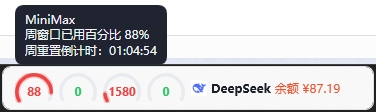

- 用量圆环 / 迷你图表 / 文本直接嵌入 Windows 任务栏，**不占屏幕任何额外空间**
- 可配置迷你图表类型、显示数量、滚动切换

[任务栏滚轮切换视频演示](http://xhslink.cn/o/880RSEgQ3lf)

### 系统托盘 + 悬浮窗

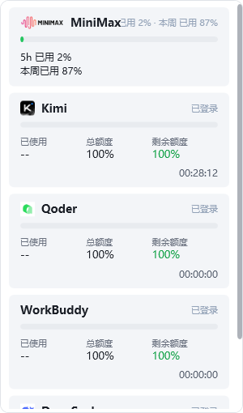

- 鼠标悬停托盘图标，立即弹出当前用量概览
- 右键菜单支持快速刷新、打开设置、切换显示模式

### 卡片式主窗口

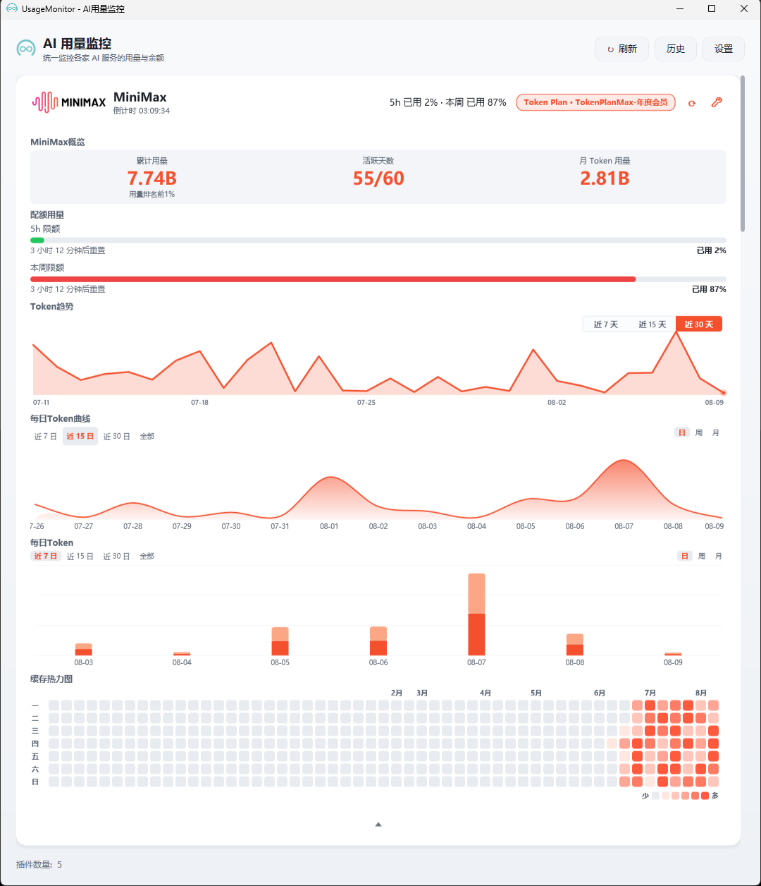

- 每个账号一张卡片，包含**进度条、数字、余额快照、图表**
- 支持图表（折线/曲线/热力图/堆叠柱状等）和 Tooltip 自定义字段
- 支持卡片顺序自定义、粒度切片（时/日/周/月）

[任意用量卡片、图表、数据的自定义排序视频演示](http://xhslink.cn/o/8PqgJZ512qJ)

### 多服务商 + 多账号

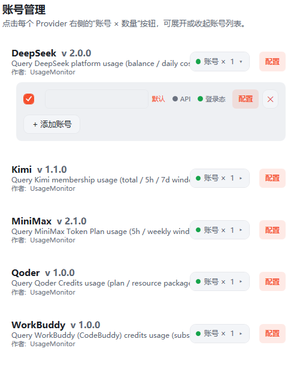

- 同一应用内管理**多家服务商**的多个账号
- 各账号独立登录态、独立刷新策略、独立历史

### 定时自动刷新

- 5 小时倒计时到点自动刷新
- 自定义周期刷新频率
- 也可随时手动点一下按钮立刻拉取

### 用量历史

- 数据**本地持久化**，按日/周/月聚合查询
- 历史窗口支持切片、排序、TopN、累计求和等聚合算子

### 丰富的图表类型


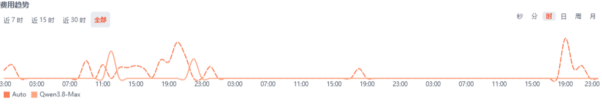

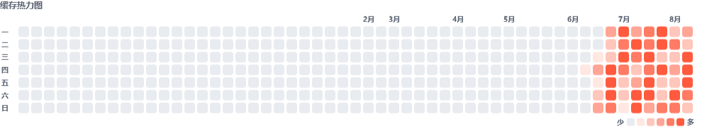

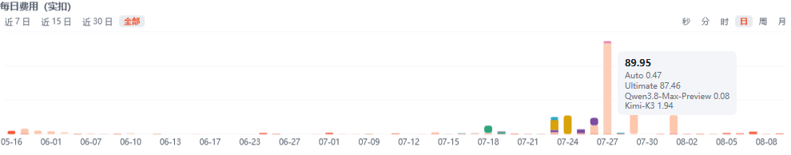


- 进度条、折线图、曲线图、热力图、堆叠柱状图、堆叠进度条
- 任务栏迷你图支持多种样式（圆环、文本、迷你折线）

### 双主题

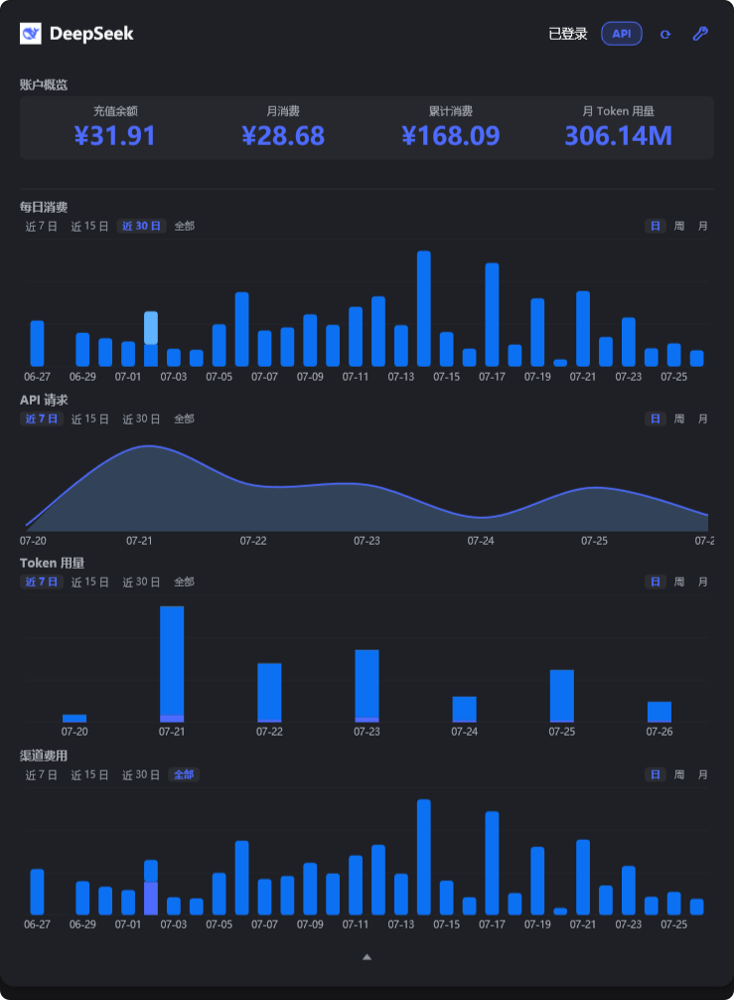

- 内置浅色 / 深色双主题
- 支持第三方主题包、图表样式包、迷你图样式包自由搭配

### 声明式插件

- 一个服务商 = 一份 **JSON 声明包**（无 DLL、无可执行代码）
- 第三方声明包安装前可校验签名，零信任风险
- 浏览器扫码登录 / Cookie 登录 / API Key 登录三种方式均支持

### 安全合规

- 登录态和 API Key 通过 **Windows DPAPI 加密**后本地存储
- 出站请求仅限插件声明的服务商域名（白名单 + SSRF 防护）
- 升级包使用 **Ed25519 签名 + SHA256 校验**，防篡改
- 所有数据隔离在程序目录（便携模式）或 `%AppData%`，**不上传任何数据**

## 设计思路

UsageMonitor 围绕五个核心理念设计：

### 简单

- **便携免安装**：解压即用，无需安装、无需管理员权限、不写注册表；卸载 = 直接删除整个目录
- **目录结构简单**：`core/`（程序本体）、`packs/`（插件与样式声明包）、`data/`（你的数据）、`tools/`（迁移工具），各司其职
- **整包迁移**：所有数据跟随程序目录，换电脑 / 换目录拷走整个目录即可

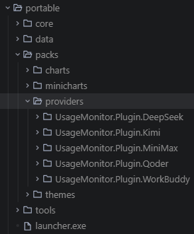

### 安全

- **基于账户的加密**：Cookie / API Key 等敏感信息经 Windows DPAPI（CurrentUser 作用域）加密后落盘，密文带自描述前缀与 HMAC-SHA256 完整性签名，仅你的 Windows 账户可解密
- **敏感信息不落明处**：不写日志、不存明文配置；凭据按账户（SID）隔离存储
- **文件访问控制**：支持 NTFS ACL 收紧，Cookie 目录与配置目录可限制为仅当前 Windows 用户可访问
- **网络边界可验证**：出站仅限插件声明的服务商域名（白名单 + SSRF 防护），无遥测、无数据上报；更新清单 Ed25519 签名 + SHA256 校验，防篡改

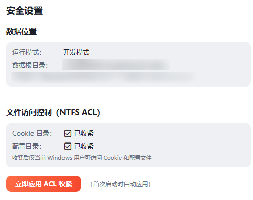

### 自由

- **纯声明式插件**：一个服务商 = 一份 JSON 声明包（零 DLL、零可执行代码），取数（fetch）/ 卡片图表（card）/ 任务栏迷你图（taskbar）全部声明式定义
- **外观自定义**：主题包、图表样式包、迷你图样式包自由搭配
- **即装即用**：第三方声明包可校验、安装、卸载，不污染宿主

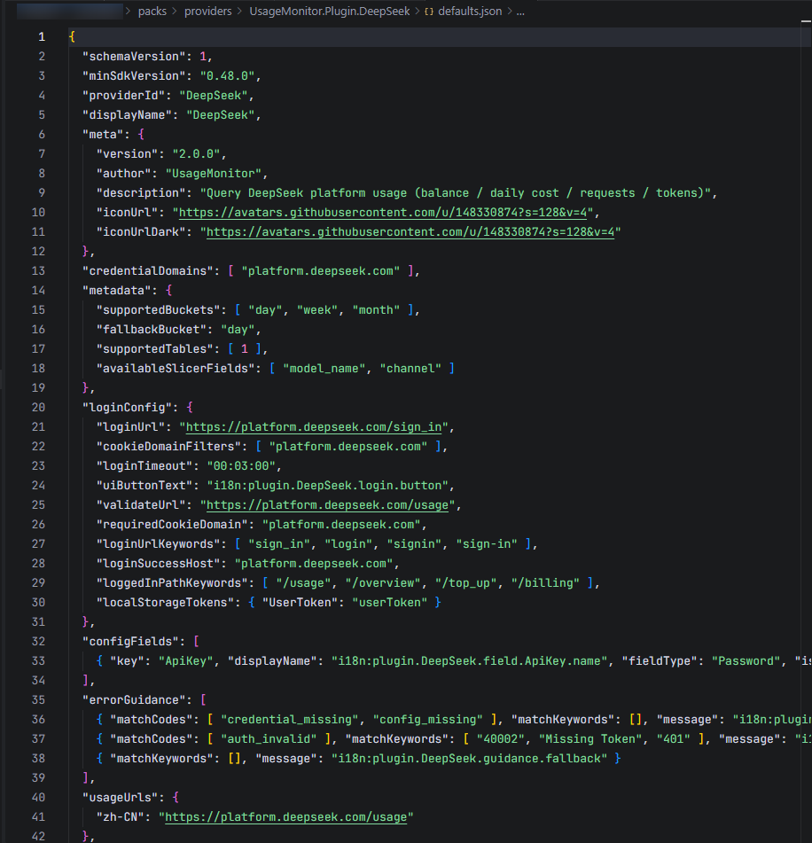

### 直观

- **任务栏直达**：用量圆环 / 迷你图 / 文本直接嵌入 Windows 任务栏，不占屏幕空间
- **悬浮窗速览**：托盘图标悬停即见用量概览，右键快速刷新 / 设置
- **卡片一目了然**：主窗口进度条、折线、曲线、热力图等图表聚合展示用量趋势

### AI 交互

- **AI 辅助插件开发**：配套一套 AI 辅助开发工具集（Agent skills：数据源调研、插件开发、卡片图表、迷你图、主题、SDK 审计）——对任意 AI 服务商：调研其用量网页 → 由 AI 生成声明包 → 校验安装即用，适配全程无需手写代码

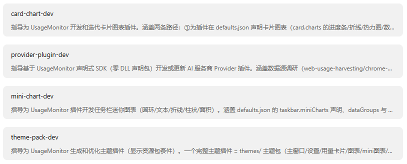

## 界面截图

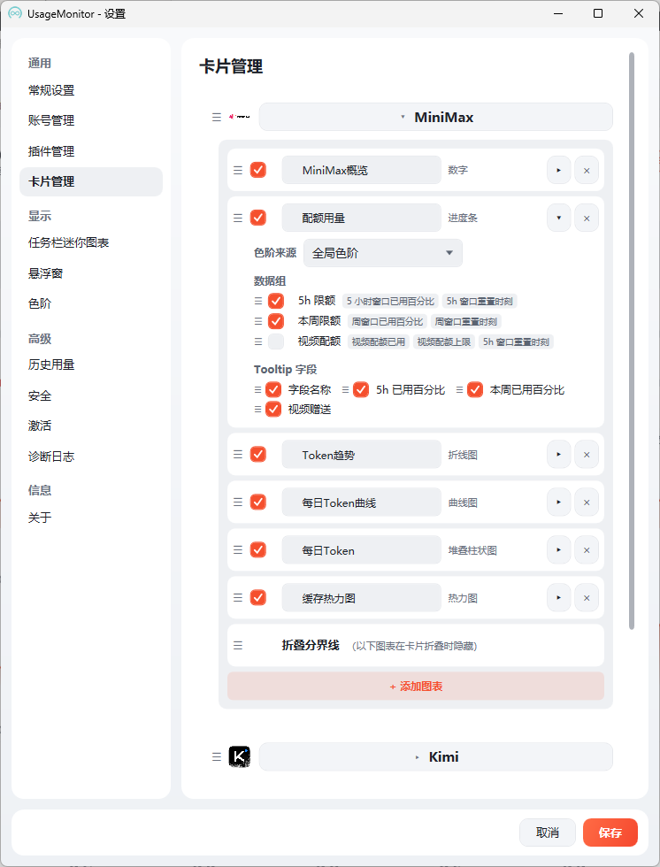

## 使用说明

1. 启动程序后，系统托盘会出现 UsageMonitor 图标
2. 右键托盘图标 → 「设置」，选择服务商并完成登录（🌐 获取登录态）或填写密钥
3. 启用「任务栏显示」，用量信息将嵌入任务栏；数据按设定间隔自动刷新
4. 悬停托盘图标可查看用量概览悬浮窗；主窗口提供完整卡片图表与历史统计
5. 支持卡片顺序自定义、图表类型自定义、数据组与 Tooltip 字段自定义

## 法律免责声明

- **非官方工具**：UsageMonitor 是独立开发的第三方工具，与 MiniMax、DeepSeek、Kimi（月之暗面）、Qoder 或任何其他 AI 服务商**均无隶属、授权或合作关系**
- **数据归属**：本工具仅帮助你**使用你自己的账户凭据，查询你自己账户内的用量数据**，不代理、不共享、不转售任何服务商的服务或数据
- **风险自担**：使用本工具查询用量属于对你自有账户的正常访问，但各服务商的服务条款可能随时变化，是否使用及由此产生的一切后果由用户自行承担
- **商标声明**：文中提及的第三方服务商名称、Logo 与商标归各自所有者所有

## 安全相关

- 凭据加密存储、网络行为边界、插件安全模型与漏洞披露方式，详见 **[SECURITY.md](SECURITY.md)**
- **关于杀毒软件误报**：UsageMonitor 是未混淆、未加壳的 .NET 程序，但由于程序未购买商业代码签名证书，部分杀毒软件可能对新发布的可执行文件产生启发式误报。若遇到误报：
  - 请通过 Release 附件的 `SHA256SUMS` 核对文件完整性，确认下载自官方 Releases 页面
  - 可将文件提交至 VirusTotal 交叉验证：https://www.virustotal.com/gui/file/ （用 SHA256SUMS 中的哈希查询）
  - 欢迎在 Issues 中反馈误报的杀软名称与版本
- 全部出站请求穷举于 [SECURITY.md 第 2 节出站清单](SECURITY.md#2-网络行为边界出站清单可验证声明)；更新检查与匿名统计均有设置页开关可关闭，采集字段以 [`docs/telemetry-schema.json`](docs/telemetry-schema.json) 白名单为唯一契约（可抓包验证）

## 许可证

本项目采用分层许可结构：

| 范围 | 许可证 | 说明 |
|------|--------|------|
| 主程序（UsageMonitor 可执行程序及其组件） | **专有免费软件 EULA** | 个人 / 非商业使用免费；**禁止再分发、禁止逆向工程**。全文见 [EULA.md](EULA.md)。 |
| SDK 契约 / 声明包 JSON / 插件模板 | **Apache License 2.0** | 社区可自由开发、分发第三方声明包与主题包，无商用限制。全文见 [LICENSE-APACHE](LICENSE-APACHE)。 |
| 云端 / 高级功能（规划中） | 专有闭源 | 多端同步、云备份、通知等高级能力，不属于本仓库范围。 |

> 第三方 AI 服务商的品牌 Logo、名称、商标归各自所有者所有。本工具**不随包分发**任何第三方 Logo——图标由程序运行时按服务商域名抓取 favicon 并缓存在本地，本项目不主张任何相关权利。

## 已知限制

- 仅支持 Windows 平台（Windows 10 / 11）
- 任务栏嵌入依赖 Windows Shell COM 接口，部分 Windows 11 版本可能存在兼容性问题
- 部分 AI 服务商未提供公开用量查询接口，相关声明包依赖网页端登录态

## 反馈与联系

- 功能建议 / 缺陷反馈：请提交 [GitHub Issues](https://github.com/masclown/UsageMonitor/issues)
- 安全漏洞：请**勿**公开提交 Issue，按 [SECURITY.md](SECURITY.md) 第 5 节的私密渠道报告
- 交流讨论：欢迎加入飞书群

  

- 视频演示与教程：[小红书合集](https://www.xiaohongshu.com/collection/item/6a659ebb15b6000000000001?xhsshare=&appuid=63889cd9000000001f01adf9&apptime=1786286834&share_id=e6674a2755b94083a0db59e96c185513&share_channel=copy_link)
